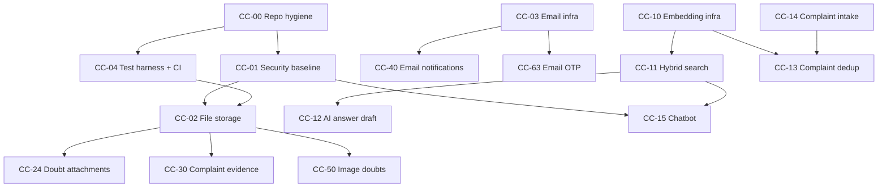

# CampusCure Roadmap

**Last updated:** 2026-09-21

Every planned feature, in dependency order, with its branch. Feature IDs (`CC-NN`) are permanent and
never reused. Effort is in ideal working days for one developer.

## Current state (baseline)

| | |
|---|---|
| Backend | Express 5 + Prisma 7 + TypeScript, ~5.8k lines across 4 controllers |
| Database | Supabase Postgres (`ap-southeast-1`, pooled) |
| Frontend | React 18 + Vite + shadcn/Radix + antd + TanStack Query, ~10.4k lines |
| Deploy | Vercel serverless (`campus_cure_backend/api/index.ts`) |
| Shipped | 4 roles, doubts/answers/upvotes/moderation, complaints w/ escalation + feedback, in-app notifications, face login |
| Missing | file storage, email, rate limiting, tests, audit log, observability |

## Architecture decisions

AI providers are **HuggingFace Inference** (embeddings), **Groq** (fast generation, tool calling),
and **Mistral** (fallback generation + vision). All hosted — nothing extra to deploy, Vercel
serverless stays viable. See [ADR-0001](adr/0001-ai-provider-strategy.md).

Vector storage is **pgvector inside the existing Supabase Postgres**, not FAISS/Chroma/Pinecone.
See [ADR-0002](adr/0002-vector-storage.md).

We stay on **Prisma 7** (aligned at 7.10.0) despite four standing `npm audit` highs — all are
build-time CLI dependencies, unreachable in our usage, and npm's suggested downgrade does not
actually fix them. See [ADR-0003](adr/0003-stay-on-prisma-7.md).

---

## Dependency graph

Critical path to the headline demo: **CC-00 → CC-01 → CC-10 → CC-11 → CC-12/CC-15**.

---

## Phase 0 — Foundations

Nothing in Phase 1+ is safe to build until these land. CC-01 in particular: adding LLM endpoints to a
backend with no rate limiting is a billing attack waiting to happen.

| ID | Feature | Repos | Branch | Est | Depends |
|---|---|---|---|---|---|
| CC-00 | Project hygiene — `.env.example` in both repos, clear stale build output. **No branch/remote changes** | both | *(any)* | 0.25 | — |
| CC-01 | Security baseline — rate limiting, helmet, refresh tokens + revocation, secret validation | backend | `feat/CC-01-security-baseline` | 3 | CC-00 |
| CC-02 | File storage layer — Supabase Storage, signed direct upload, `Attachment` model | both | `feat/CC-02-file-storage` | 3 | CC-01, CC-04 |
| CC-03 | Email infrastructure — Resend + outbox table + cron drain | backend | `feat/CC-03-email-infra` | 2 | CC-00 |
| CC-04 | Test harness + CI — Vitest, Supertest, role authorization matrix, GitHub Actions | backend | `feat/CC-04-test-harness` | 3 | CC-00 |
| CC-05 | Observability — Sentry, structured request logging | both | `feat/CC-05-observability` | 1 | CC-00 |

**Phase total: ~12.5 days**

### Why CC-04 blocks CC-02

You have 5,800 lines of backend enforcing a 4-role permission model with zero tests. Every feature
after this adds surface area to that model. Build the authorization test matrix before the surface
area grows, not after.

---

## Phase 1 — AI Core

The centrepiece. One embedding infrastructure powers three features — that's the argument for the
whole project, and it's why CC-10 is specced separately from anything that consumes it.

| ID | Feature | Repos | Branch | Est | Depends |
|---|---|---|---|---|---|
| CC-10 | Embedding infrastructure — pgvector, provider abstraction, backfill, retry queue | backend | `feat/CC-10-embedding-infra` | 4 | CC-01, CC-04 |
| CC-11 | Hybrid semantic doubt search — vector + FTS + keyword, RRF fusion, **eval harness** | both | `feat/CC-11-hybrid-search` | 5 | CC-10 |
| CC-12 | Retrieval-grounded AI answer draft — faculty review queue, never auto-publish | both | `feat/CC-12-ai-answer-draft` | 4 | CC-11 |
| CC-13 | Duplicate complaint clustering — "5 people reported this fan" | both | `feat/CC-13-complaint-dedup` | 3 | CC-10, CC-14 |
| CC-14 | Structured complaint intake — free text → category/location/priority, rules-first routing | both | `feat/CC-14-complaint-intake` | 4 | CC-01 |
| CC-15 | Tool-calling chatbot — Groq function calling over existing API, per-user authz | both | `feat/CC-15-chatbot` | 5 | CC-01, CC-11 |

**Phase total: ~25 days**

### CC-11 carries the evaluation harness

This is the single most important deliverable for a major project. A labelled set of ~50
query→duplicate pairs, and Recall@5 / MRR reported for **three** systems: existing keyword baseline,
pure vector, hybrid. Without numbers this is a feature; with numbers it's a result.

The existing keyword search at `campus_cure_backend/src/controllers/studentController.ts:566-613`
**stays in the codebase** as the baseline. Do not delete it.

### CC-14 replaces "AI predicts the department"

The original plan was to predict `category` — but the complaint form already collects it from a
dropdown, so the model would be recovering data the student supplied. CC-14 instead removes the
dropdown, takes free text, and extracts category + location + department + priority. Routing itself
stays **rules-first** (a rules table already existed at `dist/utils/autoRouting.js` before it was
deleted); ML is the fallback for unmatched text, and "rules beat ML on our dataset" is a publishable
result, not a failure.

---

## Phase 2 — Doubt Community

Mostly cheap. CC-20 through CC-22 are near-trivial and worth doing early for morale and demo density.

| ID | Feature | Repos | Branch | Est | Depends |
|---|---|---|---|---|---|
| CC-20 | Tags — `Doubt.labels[]` is written and displayed already; adds filtering, normalization, canonical display, vocabulary | both | `feat/CC-20-tags` | 1.5 | — |
| CC-21 | Bookmarks — save doubts for later | both | `feat/CC-21-bookmarks` | 1 | — |
| CC-22 | Code syntax highlighting — Shiki, read path only | frontend | `feat/CC-22-code-highlighting` | 0.5 | — |
| CC-23 | Rich text editor — TipTap, sanitised HTML, math via KaTeX | both | `feat/CC-23-rich-text` | 4 | CC-02 |
| CC-24 | Doubt & answer attachments — PDF/image/zip | both | `feat/CC-24-doubt-attachments` | 2 | CC-02 |
| CC-25 | Reputation & badges — points, ranks, leaderboard, anti-gaming caps | both | `feat/CC-25-reputation` | 4 | — |
| CC-26 | Faculty performance — **private to self + admin**, not a public leaderboard | both | `feat/CC-26-faculty-stats` | 2 | CC-25 |
| CC-27 | Staff directory — teaching/non-teaching, routable complaint targets | both | `feat/CC-27-staff-directory` | 3 | CC-14 |

**Phase total: ~17.5 days**

### CC-26 is deliberately not a public leaderboard

Publicly ranking named faculty by response time creates political risk with the people who approve
your deployment, and rewards answering many easy doubts. Individual stats visible to the individual
and to admins; departmental aggregates can be public.

### CC-27 fixes a real routing bug

The deleted rules table routed a broken fan to *teaching faculty in Electrical Engineering*. Fans are
fixed by electricians, not lecturers. Non-teaching staff need to exist as first-class routing targets
or CC-14 routes correctly to the wrong kind of person.

---

## Phase 3 — Complaint System

| ID | Feature | Repos | Branch | Est | Depends |
|---|---|---|---|---|---|
| CC-30 | Complaint photo/video evidence + before/after resolution proof | both | `feat/CC-30-complaint-evidence` | 3 | CC-02 |
| CC-31 | SLA timers + automatic escalation via Vercel cron | backend | `feat/CC-31-sla-escalation` | 2 | CC-03 |

**Phase total: ~5 days**

CC-30 is the highest-value non-AI feature on the entire roadmap. A photo removes the whole "which
chair, which room, how broken" round trip, and resolution photos plug directly into the existing
`studentConfirmed` / `feedbackRating` flow. It also produces the image dataset CC-50 needs.

CC-31 activates fields you already have — `escalationCount` and `ESCALATED_TO_SUPERADMIN` exist but
escalation is manual.

---

## Phase 4 — Notifications

| ID | Feature | Repos | Branch | Est | Depends |
|---|---|---|---|---|---|
| CC-40 | Email notifications — channel over existing `Notification` model | backend | `feat/CC-40-email-notifications` | 2 | CC-03 |
| CC-41 | Web push — service worker, VAPID | both | `feat/CC-41-web-push` | 3 | CC-05 |
| CC-42 | Telegram bot — free, instant, demos like WhatsApp | backend | `feat/CC-42-telegram` | 2 | CC-40 |

**Phase total: ~7 days**

**WhatsApp is deferred, not forgotten.** The WhatsApp Business API needs a verified business entity,
a Meta Business account, template pre-approval, and per-message fees — a student project on a college
domain generally cannot clear that. CC-40/41/42 build a **pluggable multi-channel notification
architecture**; WhatsApp becomes one more provider the day the paperwork exists. That framing is
stronger in a report than a single hardcoded integration.

Serverless note: never send inline in a request handler and never `setTimeout` — the lambda freezes.
Everything drains through the CC-03 outbox.

---

## Phase 5 — Multimodal

| ID | Feature | Repos | Branch | Est | Depends |
|---|---|---|---|---|---|
| CC-50 | Image-based doubt submission — Pixtral vision, no OCR step | both | `feat/CC-50-image-doubts` | 3 | CC-02, CC-10 |

**Phase total: ~3 days**

Replaces the original OCR phase. Classical OCR (Tesseract) fails badly on handwriting and cannot
represent diagrams or equations at all. A vision model reads the handwriting *and* understands the
question in one call — better accuracy, less code, and it handles the diagram case that OCR
structurally cannot. The original image stays attached so faculty see what the student actually wrote.

---

## Phase 6 — Security & Compliance

Ordered by actual risk, which is **not** the order in the original plan. TOTP is fine, but an
unauthenticated biometric endpoint with no liveness check is the open window next to the deadbolt.

| ID | Feature | Repos | Branch | Est | Depends |
|---|---|---|---|---|---|
| CC-60 | Face login hardening — liveness challenge, demote to 2nd factor, encrypt templates | both | `feat/CC-60-face-hardening` | 4 | CC-01 |
| CC-61 | Audit log — immutable trail for admin actions | backend | `feat/CC-61-audit-log` | 2 | CC-04 |
| CC-62 | TOTP 2FA — authenticator app, recovery codes | both | `feat/CC-62-totp-2fa` | 3 | CC-01 |
| CC-63 | Email OTP login | both | `feat/CC-63-email-otp` | 2 | CC-03, CC-62 |
| CC-64 | DPDP compliance — consent, data export, deletion, retention policy | both | `feat/CC-64-dpdp` | 3 | CC-61 |

**Phase total: ~14 days**

### CC-60 is the urgent one

`FaceLoginPage.tsx` submits a descriptor to an unauthenticated endpoint that scans all users for a
match. Server-side matching is the right call, but: **a printed photo held to the webcam
authenticates as that student**, and 1:N identification with no claimed identity has a false-match
rate that grows with user count. Also `User.faceDescriptor` stores biometric templates in plaintext —
that's regulated data under the DPDP Act.

---

## Phase 7 — Platform

| ID | Feature | Repos | Branch | Est | Depends |
|---|---|---|---|---|---|
| CC-70 | PWA + offline **read** cache | frontend | `feat/CC-70-pwa` | 3 | CC-41 |
| CC-71 | i18n — Hindi, for non-teaching staff filing complaints | both | `feat/CC-71-i18n` | 4 | — |
| CC-72 | Controller → service refactor — 5.8k lines in 4 files is past maintainable | backend | `refactor/CC-72-services` | 5 | CC-04 |

**Phase total: ~12 days**

---

## Deliberately cut

Keeping the reasoning is the point — these will come up again.

| Feature | Why cut |
|---|---|
| Full offline doubt sync | Conflict resolution + background sync + local store is a semester of work for a problem campus wifi doesn't have. CC-70 delivers ~80% of the perceived value for 10% of the work. |
| Assignments system | A second product — submissions, deadlines, grading, plagiarism. Bolting it on makes both worse. Next project. |
| Student social media directory | You already store minors' phone numbers, addresses, guardian names and guardian phones. A searchable people-finder over that is a harassment vector. CC-27 covers the legitimate need with opt-in professional contact info for staff. |
| WhatsApp notifications | Commercially blocked (see Phase 4). Architecture supports it; integration deferred. |
| Public faculty leaderboard | See CC-26. |
| Standalone OCR pipeline | Superseded by CC-50. |

---

## Totals

| Phase | Days |
|---|---|
| 0 — Foundations | 12.5 |
| 1 — AI Core | 25 |
| 2 — Community | 17.5 |
| 3 — Complaints | 5 |
| 4 — Notifications | 7 |
| 5 — Multimodal | 3 |
| 6 — Security | 14 |
| 7 — Platform | 12 |
| **Total** | **~96 ideal days** |

Ideal days assume no context switching. At a realistic student pace (2–3 productive hours/day
alongside coursework) plan for **5–7 calendar months** for everything, or **~10 weeks** for the
Phase 0 + Phase 1 + Phase 3 core that makes the strongest demo.

### Minimum viable major project

If time compresses, this subset still tells a complete story:

**CC-00, CC-01, CC-04, CC-02, CC-10, CC-11, CC-12, CC-15, CC-30** — ~30 days.

Foundations, one embedding system powering search and answer generation, a chatbot that demos well,
and complaint photos. Everything else is additive.

---

## Git strategy

> **Team decision (2026-08-16): the existing branch and remote setup is not changed by this roadmap.**
> `main`, `master`, `austin`, and `rupesh` stay exactly as they are. Nothing below is executed
> unilaterally — the branch column in the tables above is a *naming suggestion* for whoever picks up
> a spec, not an instruction to restructure the repository.

Two independent repos (`campus_cure_backend`, `CampusCure_Frontend`), currently using per-developer
branches (`austin`, `rupesh`). That works at the current team size, and this roadmap does not require
changing it.

**What the roadmap does require**, whatever branching model the team uses, is an answer to *"is CC-10
finished?"* — because CC-11, CC-12, and CC-13 cannot start until it is. That's a coordination
convention, not a git restructure, and it costs nothing to adopt today:

1. **One owner per spec at a time.** Declare it before starting; update the spec's `Status` and add
   your name.
2. **Dependent work doesn't start until the dependency's owner confirms it's merged.** The
   `Depends on` column in each spec is the contract.
3. **Commits reference the spec ID** — `CC-11: add reciprocal rank fusion`. This makes "what landed
   for CC-10?" answerable with `git log --grep`, regardless of branch layout.
4. **Cross-repo features are merged together.** Frontend must never ship against a backend change
   that isn't deployed.
5. **Rebase before generating a Prisma migration** (see below).

**If the team later wants per-feature branches**, the conventional model is `main` (production) ←
`develop` (integration) ← `feat/CC-NN-slug`, with the existing personal branches archived rather than
deleted. That's a discussion to have together, and CC-00 records the observations that motivate it.
It is not a prerequisite for starting the roadmap.

**Migration discipline** — this is the one place where a shared repo bites regardless of branching
model. Prisma migrations are an ordered sequence. If two people generate migrations at the same time,
they conflict, and resolving it after both have applied locally is genuinely painful. Rules:

- Pull and rebase **immediately before** running `prisma migrate dev`.
- Name migrations for the feature: `--name cc10_add_embeddings`.
- Announce it when you're about to create one. Only one person generates a migration at a time.

---

## Spec index

| ID | Spec | Status |
|---|---|---|
| CC-00 | [Project hygiene & conventions](specs/CC-00-repo-hygiene.md) | **Shipped** 2026-09-19 |
| CC-01 | [Security baseline](specs/CC-01-security-baseline.md) | **Shipped** — completed by CC-01b |
| CC-01b | [Refresh tokens & revocation](specs/CC-01b-refresh-tokens.md) | **Shipped** 2026-09-20 — complete |
| CC-04 | [Test harness & CI](specs/CC-04-test-harness.md) | **Shipped** 2026-09-19 |
| CC-01c | [Privileged role escalation](specs/CC-01c-privileged-role-escalation.md) | **Shipped** 2026-09-19 |
| CC-10 | [Embedding infrastructure](specs/CC-10-embedding-infra.md) | **Shipped** 2026-09-19 |
| CC-11 | [Hybrid semantic search + eval harness](specs/CC-11-hybrid-search.md) | **Shipped** 2026-09-19 |
| CC-12 | [Retrieval-grounded AI answer drafts](specs/CC-12-ai-answer-draft.md) | **Shipped** 2026-09-20 — complete |
| CC-13 | [Duplicate complaint detection](specs/CC-13-complaint-dedup.md) | **Shipped** 2026-09-20 — complete (13/13) |
| CC-14 | [Structured complaint intake](specs/CC-14-complaint-intake.md) | **Shipped** 2026-09-20 — complete |
| CC-15 | [Tool-calling chatbot](specs/CC-15-chatbot.md) | **Shipped** 2026-09-20 — complete |
| CC-40 | [Email notifications](specs/CC-40-email-notifications.md) | **Implemented** 2026-09-21 — migration applied |
| CC-03 | [Email infrastructure](specs/CC-03-email-infra.md) | **Implemented** 2026-09-21 — migration applied; needs a verified domain |
| CC-02 | [File storage layer](specs/CC-02-file-storage.md) | **Dormant** 2026-09-21 — code complete, off pending Supabase dashboard access |
| CC-20 | [Doubt tags](specs/CC-20-tags.md) | **Shipped** 2026-09-21 — migration applied |
| CC-21 | [Doubt bookmarks](specs/CC-21-bookmarks.md) | **Shipped** 2026-09-21 — migration applied |
| CC-22 | [Code syntax highlighting](specs/CC-22-code-highlighting.md) | **Shipped** 2026-09-21 |
| — | [Spec template](specs/TEMPLATE.md) | — |

Remaining features are specced just-in-time, one phase ahead of implementation. Writing all ~30 specs
now would guarantee most of them are stale before they're read — the roadmap above holds the scope
and sequencing; specs hold the detail, written when the work is next.
